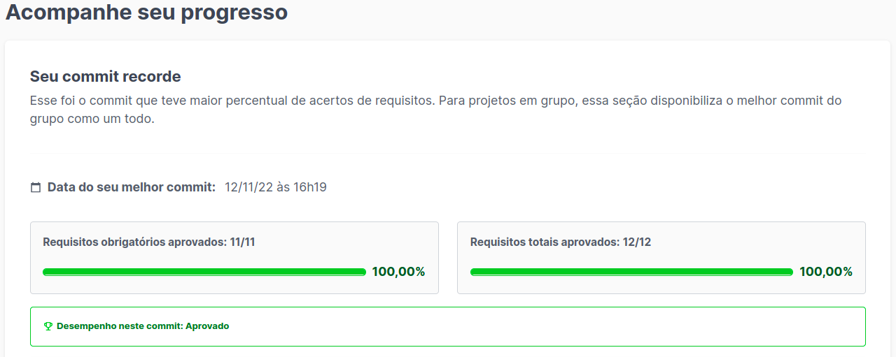

# Docker-Todo-List
<h1>Descrição</h1>

  
Projeto desenvolvido na Trybe durante o módulo de Back-End

  
Primeiro projeto realizado no módulo de back-end da Trybe. Colocamos em prática o uso de Docker para conteinerizar uma aplicação react (front-end, back-end e testes).
conteinerizando as partes da aplicação, criando suas conexões e orquestrando seu funcionamento.

<h1>Ferramentas</h1>

  <ul>
  <li>Docker</li>
  <li>Dockerfile</li>
  <li>Docker-compose</li>
</ul>

<h1>Resultado</h1>

